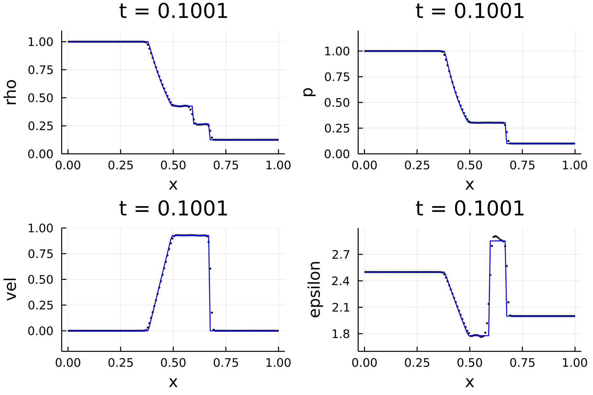

# Hydro

[](https://chongchonghe.github.io/Hydro.jl/stable/)
[](https://chongchonghe.github.io/Hydro.jl/dev/)
[](https://github.com/chongchonghe/Hydro.jl/actions/workflows/CI.yml?query=branch%3Amain)
[](https://codecov.io/gh/chongchonghe/Hydro.jl)

Hydro.jl is a modular hydrodynamic code written in pure Julia. 

<!-- ## Getting Started -->

<!-- ### Dependencies -->

<!-- - [Julia](https://julialang.org/), a high-level, high-performance, dynamic programming language -->

## Installation

This package can be installed using the Julia package manager from the Julia command line:

``` julia
julia> using Pkg; Pkg.add("Hydro")
```

<!-- First, clone this repository to a directory -->

<!--     git clone https://github.com/chongchonghe/Hydro.git -->


## Tests and Demo

### Sod tube shock wave



Run:

```julia
using Hydro
hydro(1, 128, 0.1, "/tmp/Hydro/sod-128", init_sod; solver=hllc, dtout=0.01, plotit=plot_standard_sod)
```

<!-- or  -->

<!-- ```shell -->
<!-- julia ~/.julia/packages/Hydro.jl/src/run.jl sod 128 0.1 hllc RK3 /tmp/Hydro/sod-128 -->
<!-- ``` -->

### Kelvin-Helmholz instability

Click on the gif to see a full video on vimeo.com. Click [here](https://github.com/chongchonghe/shared-files/blob/main/github/hll-2d-KH-512.new3.30hz.mp4?raw=true) to download a lossless video (34 MB).

[](https://vimeo.com/734536881)

<!-- Run: `julia Hydro.jl/src/run.jl KH 512 1.0 /tmp/Hydro/KH-512 --dtout0.005 --verbose`.  -->

```julia
hydro(1, 512, 1.0, "/tmp/Hydro/KH-512", init_KH; dtout=0.005, verbose=true)
```

## Technical Description

- Riemann solver
	  - HLL
	  - HLLC
	  - Lax
- Integrator
	  - Euler
	  - RK2
	  - RK3
- Initial conditions
	  - 2D Kelvin-Helmholtz instability
	  - 1D and 2D sod shock tube
- Boundary condition
	  - Transimissive
	  - Periodic

TODO: add descriptions to the Riemann solvers, interpolation method, etc.

<!-- ## Getting Started -->

<!-- ### Dependencies -->

<!-- - [Julia](https://julialang.org/), a high-level, high-performance, dynamic programming language -->

<!-- ### Installation -->

<!-- This package can be installed using the Julia package manager from the Julia command line: -->

<!-- ``` julia -->
<!-- julia> using Pkg; Pkg.add("ArgParse") -->
<!-- ``` -->

<!-- First, clone this repository to a directory -->

<!--     git clone https://github.com/chongchonghe/Hydro.git -->

## Usage

<!-- After installation, you can use this module either with command line interface or Julia REPL. -->

<!-- Examples of using Hydro.jl: -->
<!-- in the Julia REPL (read-eval-print loop): -->

    julia> using Hydro
    
    julia> hydro(1, 512, 0.1, "tmp", init_sod)
    
    julia> hydro(1, 512, 0.2, "tmp2", init_sod, restart=10)

<!-- ### Run with the command line interface -->

<!-- Run `julia run.jl -h` for a detailed instruction. Here are some simple examples: -->

<!--     julia Hydro.jl/src/run.jl sod 128 0.1 tmp -->
<!--     julia Hydro.jl/src/run.jl KH 512 1.0 examples/KH_512 -->

For a complete documentation, run `?hydro`. 

Once a run is finished, a reloadable data file for the last snapshot is stored in `[folder]/data`.  You can reload the simulation by setting `restart` and increasing `tend`. You may also interrupt a simulation with Ctrl-c and the most recent snapshot will be saved.

<!-- Optionally, you may add a `-i` option to the `julia` command to make the run more flexible by bringing two extra features: -->

<!-- 1.  You may interrupt the run at any time by pressing `Ctrl-c` and the program will save all the necessary data needed to resume the run before quitting. -->
<!-- 2.  After the program is finished, you will be returned to the Julia REPL where the program was running, and you will be able to start another run immediately by using `hydro(...)`. See the next section `Run with REPL` for details. -->


## Help

## Authors

ChongChjong He (che1234 @ umd.edu) (https://www.astro.umd.edu/~chongchong/)

## Version History

